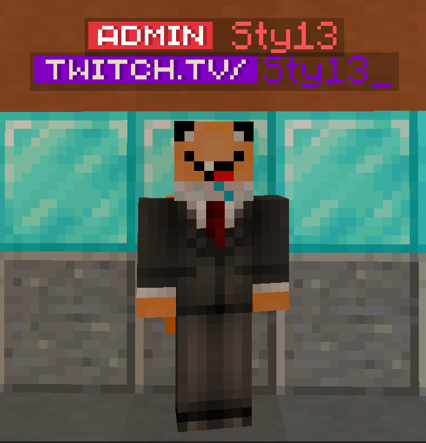

# 📜 Changelog

## 📜 **Season 2 | 11/09-13/10 | Pré Alpha 0.3.7**

### 🧰 Correções de bugs

* As cinemáticas não usavam o gamemode spectador, agora usam :)
* Ao entrar pela primeira vez no servidor, o som da cinemática não toca (O bug é conhecido mas não foi corrigido ainda pois envolve ações de pessoas terceirizadas)
* Ocorreu alguns problemas com a UUID de alguns jogadores que já entraram no servidor, mas isso foi corrigido e não esperamos que aconteça novamente!
* O som ambiente não tocava se você estivesse a mais de 16 blocos do spawn

#### 🧰 Correções de bugs - Lobby

* O seletor de server no lobby não estava conectando a season 2
* As mensagens do evento não apareciam corretamente
* As musicas não tocavam se você estivesse a mais de 16 blocos do centro do mapa

### 📤 Adicionado

* Foram adicionados Grappling Hooks para facilitar a movimentação nos mundos. [**ᵇᵉᵗᵃ**](changelog.md#season-2-or-03-de-agosto-or-pre-alpha-0-2-9-pequeno-update)** **
* Foi adicionado 2 novas cinemáticas ao servidor (Ao entrar pela primeira vez e ao iniciar a quest do banco)
* Foi adicionadas novas partículas ao jogo
* Um novo sistema de email foi adicionado [**ᵇᵉᵗᵃ**](changelog.md#season-2-or-03-de-agosto-or-pre-alpha-0-2-9-pequeno-update)** **

####  📤 Adicionado - Lobby

* Adicionado comandos para inicialização do evento de abertura do servidor!
* Adicionado um tab
* Pré evento adicionado
* Um plugin de cosméticos foi adicionado ao lobby (Não há conexão á season 2)
* O seletor de servidores foi atualizado
* Uma textura própria ao lobby foi adicionada, isso faz com que a textura descarregue e depois carregue a da season 2 ao entrar no servidor survival! (Iremos tentar amenizar/eliminar o tempo de descarregamento e carregamento da textura)
* O evento principal foi adicionado ao lobby

### 🔨 Modificado

* Agora o portal é mais transparente
* Algumas partículas foram atualizadas
* Agora o uso de memória ram do servidor é menor
* Agora o carregamento da textura é ainda mais rápido
* TODOS os blocos foram re-colocados dentro do jogo
* O site do servidor foi modificado para conter outra data de lançamento (ainda não disponível para mobile)

## 📜 **Season 2 | 11 de setembro | Pré Alpha 0.3.6**

### 🧰 Correções de bugs

* A textura não carregava corretamente e você ficava preso no limbo ;-;
* O som das madeiras simplesmente sumiram do pack padrão, mas agora estão de volta (não me pergunte como arrumei, pq nem eu sei) 
* O sistema de proximity audio acabou bugando quando eu atualizei para o bungeecoord, mas agora já está tudo rodando perfeitamente (só alguns erros aqui e ali, mas preguiça)
* Todos os sons estavam sendo transmitidos por um modo incorreto (gambiarra). Mas agora com o nosso novo SUPER ULTRA MEGA SOUND SYSTEM, brincadeira, só uma nova feature no plugin :)
* Com a alteração do sistema do som ^ os sons já setados como som ambiente, campainha e sons de economia bugaram ;-; mas já foi arrumado hehe
* OS BLOCOS BUGARAM DE NOVO, mas agora achamos o problema :)
* Foi corrigido alguns bugs de dupe como xp infinito no /skills (sim, isso crasha o servidor)

### 📤 Adicionado

* Um sistema de plugins foi implementado! (Isso ajudará ao ligar/desligar/reiniciar plugins :>)
* Agora temos um lobby :dance: 
* SIstema de fila
* O /navegador agora aparece normalmente (ele não fica mais vermelho como se não existisse)
* Um audio ao entrar no servidor :^) só pra teste isso na verdade
* Foi adicionado uma sessão de [como claimar um terreno](dicas/untitled.md)! ainda não tem nada lá, mas logo logo irei adicionar.
* Agora temos um banco :pog:

### 🔨 Modificado

* Todos os plugins foram atualizados corretamente! Chega daquelas mensagens spammando o chat.   ^ EDIT: mais plugins foram atualizados, alguns não falam que precisam ser atualizados! 
* Os blocos existentes bugaram, mas agora conseguimos colocar um ID especifico em cada um :)

## 📜 **Season 2 | 24-27 de agosto | Pré Alpha 0.3.5 HOT FIX & UPDATES**

### 🧰 Correções de bugs

* Por algum motivo o evento `player_world`_ _foi alterado para_ _`world_to` Fazendo assim o som ambiente do servidor não ser tocado corretamente!
* Alguns blocos foram recolocados no servidor depois do incidente com os móveis (desculpa Luiz)
* Os ranks foram de novo alterados para outro caractere, mas agora com um sistema novo nós achamos que não irá mais acontecer ;)
* Ocorreu alguns problemas com a conexão ovh->vps, nossa equipe aplicou uma gambiarra para arrumar o problema provisoriamente. 

### 📤 Adicionado

* Novos grupos: Time, staff, mod, twitch.tv, youtube, elite, pro, mvp, vip, alpha e finalmente player :)

* Sistema de proximity voice adicionado. [**ᵇᵉᵗᵃ**](changelog.md#season-2-or-03-de-agosto-or-pre-alpha-0-2-9-pequeno-update)
* Sistema de sound-per-browser adicionado. [**ᵇᵉᵗᵃ**](changelog.md#season-2-or-03-de-agosto-or-pre-alpha-0-2-9-pequeno-update)
* Sistema de AFK adicionado.
* Banco foxes adicionado. [**ᵇᵉᵗᵃ**](changelog.md#season-2-or-03-de-agosto-or-pre-alpha-0-2-9-pequeno-update)

### 🔨 Modificado

* Algumas cores no chat foram modificadas :)
* Agora a tag "twitch.tv/" não contem a "/", tava feia de mais ;-;

## 📜 **Season 2 | 19 & 22 de agosto | Pré Alpha 0.3.4**

### 🧰 Correções de bugs

* O rank admin era substituído pelo caractere incorreto!
* Alguns comandos estavam sendo birrentos e não queriam rodar corretamente!
* Agora o /F5 e o /reload-texture funcionam corretamente (eu espero)!

### 📤 Adicionado

* Agora a twitch ou o Youtube dos jogadores aparecem de baixo do nick! [**ᵇᵉᵗᵃ**](changelog.md#season-2-or-03-de-agosto-or-pre-alpha-0-2-9-pequeno-update)

* Agora ao entrar no servidor você irá ser teleportado(a) para um lugar calmo até que a sua textura carregue! (de nada)
* Agora temos uma loja de móveis, quer dizer, apenas o esqueleto dela ;-; 

### 🔨 Modificado

* A changelog não contem mais \[SERVER] antes das atualizações/correções de bugs/modificação para deixar mais fácil de nós criarmos as changelogs :)
* Agora a mensagem de "Você foi teleportado para `insiraonomedawarp`" é só "Você foi teleportado(a) com sucesso"

## 📜 **Season 2 | 13 de agosto | Pré Alpha 0.3.3**

### 🧰 Correções de bugs

* `[SERVER]` As plantas não cresciam naturalmente!
* `[SERVER]` Agora não é necessário de uma textura custom para ouvir o som ambiente do spawn!
* `[SERVER]` Todos as furnitures foram movidas para o item "diamante" para não ocorrer conflitos
* `[SERVER]`Os itens bugados foram substituídos pelos itens corretos!

### 📤 Adicionado

* `[SERVER] 36 novos móveis foram adicionados, sendo 21 deles pintáveis`
* `[SERVER]`Tocos de Madeira e Bancos de praça foram espalhados pela cidade para você poder sentar se estiver cansado :)
* `[SERVER]` Começamos hoje os teste com novas IU (Interface de usuário) :)

### 🔨 Modificado

* `[REDE]` A proteção anti DDOS foi aprimorada!
* `[SERVER]` O nether e o end foram desabilitados para aprimoramento da geração dos mesmos!

## 📜 **Season 2 | 09 & 10 de agosto | Pré Alpha 0.3.2 (BUG FIX)**

### 🧰 Correções de bugs

* `[SERVER]`Blocos colocados eram duplicados ao quebrar (causado pelo anticheat)!
* `[SERVER]`A barra de xp de escavação ficava invisível!
* `[SERVER]`Ao mudar de mundos o seu modo de jogo era constantemente alterado!
* `[SERVER]`O servidor reiniciava em horários randômicos!
* `[SERVER]`O console mandava feedback dos comandos executados por ele!
* `[SERVER]`O teleporte do /navegador não funcionavam corretamente!
* `[REDE]`O IP anterior do domínio mine.foxyb.live estava incorreto e foi alterado para o correto!

### 📤 Adicionado

* `[SERVER]`Ao mudar de mundos o servidor muda seu modo de jogo! [**ᵇᵉᵗᵃ**](changelog.md#season-2-or-03-de-agosto-or-pre-alpha-0-2-9-pequeno-update)
* `[SERVER]`Ao entrar na ilha das raposas o som ambiente tocará! (apenas com a textura custom)[**ᵇᵉᵗᵃ**](changelog.md#season-2-or-03-de-agosto-or-pre-alpha-0-2-9-pequeno-update)

### 🔨 Modificado

* Nada :(

## 📜 **Season 2 | 06-07 de agosto | Pré Alpha 0.3.1**

### 🧰 Correções de bugs

* `[SERVER]`Blocos sem textura agora contêm as texturas corretas!
* `[SERVER]`Agora o nome do servidor no ESC está correto!
* `[SERVER]`Blocos agora não duplicam ao quebrar!
* `[SERVER]`Agora a textura mostra o ultimo dia que foi alterada!
* `[SERVER]`Novos blocos não quebram mais as texturas dos blocos anteriores!
* `[SERVER]`As folhas agora são mais "fofas" :)
* `[SERVER]`As slabs de terra foram re-texturizadas novamente!

### 📤 Adicionado

* `[SERVER]`4 novos cosméticos pintáveis, [clique aqui](novos-itens-blocos/cosmeticos.md) para ver!
* `[SERVER]`43 novas recipes adicionadas para os novos blocos
* `[SERVER]`Arvore de bananeira adicionada! [**ᵇᵉᵗᵃ**](changelog.md#season-2-or-03-de-agosto-or-pre-alpha-0-2-9-pequeno-update)

### 🔨 Modificado

* `[WIKI]`A wiki foi movida para um repositório publico no github! [**Clique aqui para ver**](https://github.com/Sty13/FoxyLandWiki)**!**

## 📜 **Season 2 | 05 de agosto | Pré Alpha 0.3.0**

### 🧰 Correções de bugs

* `[SERVER]`Blocos não mostrando a textura corretamente
* `[SERVER]`As antigas receitas não davam o bloco correto
* `[SERVER]`Congelamento de FPS (client-side)

### 📤 Adicionado

* `[SERVER]`Mais de 183 blocos novos! [**ᵇᵉᵗᵃ**](changelog.md#season-2-or-03-de-agosto-or-pre-alpha-0-2-9-pequeno-update)
* `[SERVER]`Mais de 56 receitas adicionadas! [**ᵇᵉᵗᵃ**](changelog.md#season-2-or-03-de-agosto-or-pre-alpha-0-2-9-pequeno-update)
* `[SERVER]`Novos itens de agricultura (como banana, alface, berinjela e muito mais!) [**ᵇᵉᵗᵃ**](changelog.md#season-2-or-03-de-agosto-or-pre-alpha-0-2-9-pequeno-update)
* `[SERVER]`2 novos cosméticos adicionados!

### 🔨 Modificado

* `[SERVER]`Caixa de chilli agora se chama Caixa de Pimenta!
* `[SERVER]`Caixa de cana seca agora se chama Caixa de velas!

## 📜 **Season 2 | 03 de agosto | Pré Alpha 0.2.9 (pequeno update)**

### Correções de bugs

* `[REDE]`O mundo de recursos foi movido de volta para o servidor principal!
* `[SERVER]`Ao entrar no servidor a textura será automaticamente carregada. [**ᵇᵉᵗᵃ**](changelog.md#season-2-or-03-de-agosto-or-pre-alpha-0-2-9-pequeno-update)

### Adicionado

* `[SERVER]`Novo mapa principal adicionado!
* `[SERVER]`Portal com um teleporte randomizado adicionado
* `[SERVER]`Novos emotes adicionados você pode ver a lista [aqui](https://hastebin.com/jososivoxu.less)
* `[SERVER]`Perfil de jogador adicionado
* `[SERVER]`Novo sistema de pescaria adicionado
* `[SERVER]`Novos NPCs adicionados ao redor do mapa
* `[SERVER]`Loja de brinquedos adicionada
* `[SERVER]`Sistema de reviver adicionado

### Modificado

* Nada ☹️

## 📜 **Season 2 | 28 de julho | Pré Alpha 0.2.1 (pequeno update)**

### Correções de bugs

* Nada ☹️

### Adicionado

* Nada ☹️

### Modificado

* `[REDE]`Todos os servidores agora estão na versão 1.17.1!
* `[REDE]`O desenvolvimento do servidor será desacelerada um pouco, não muito ❤️
