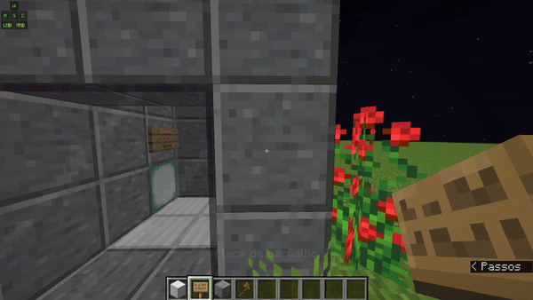

# 🔼Elevadores - Como instalar?


Este artigo foi feito na fase Pré alpha do servidor e poderá mudar na versão alpha ou beta, mas não irá parar de funcionar pois a maioria das mudanças que pretendemos fazer é apenas visual!


## Preparativos

Faça o túnel no qual o elevador se movimentará! O túnel tem que se um quadrado, então ele pode ser 2x2 blocos, 3x3, 4x4, 5x5 e etc...

### 🔨 Construindo o piso

Para começar preencha o piso do elevador na parte mais baixa do elevador, os pisos podem ser feitos de:&#x20;

* Bloco de iron
* Bloco de ouro
* Bloco de esmeralda
* Bloco de diamante

Sendo cada um deles mais rápido que o outro. Ex: Elevadores com bloco de iron se movem a 8 BPS (blocos por segundo), já os elevadores com bloco de diamante se movem a 15 BPS mas neste tutorial estarei utilizando o elevador de iron! (Novos tipos de elevadores podem ser adicionados ao decorrer do tempo!)

### 💻Configurando o elevador

Para configurarmos o elevador precisamos saber de algumas "regras":

1. Ao colocar a placa ela **SEMPRE** deve estar dois blocos acima do piso (como no gif abaixo)
2. Para o elevador funcionar, você precisa colocar a placa onde o elevador está, ou seja, dentro do quadrado no qual o elevador irá se movimentar
3. O nome do piso sempre deve ficar na ultima linha da placa.

Agora que sabemos essas "regras", poderemos construir o nosso primeiro piso!&#x20;

Pegue uma placa (de qualquer material) e coloque dois blocos acima do piso (como no gif abaixo)&#x20;


Tente sempre colocar a placa no mesmo lugar em todos os pisos, tanto para aspectos quando para evitar bugs desconhecidos!&#x20;


Para fazer múltiplos andares, basta repetir este processo nos outros andares (Lembre-se de mudar o nome do piso na ultima linha da placa)&#x20;

### 📢Chamando o elevador

Tenta adivinhar como que faz, vai :) eu confio em você, tentaaa... Tá bommmm eu falo!&#x20;

Pegue uma placa e coloque do lado de fora do elevador e escreva "call" (como no gif abaixo)

E é isso, você criou seu primeiro elevador (ou segundo pq talvez esqueceu e veio aqui dar uma olhada de como se faz hehe)&#x20;
