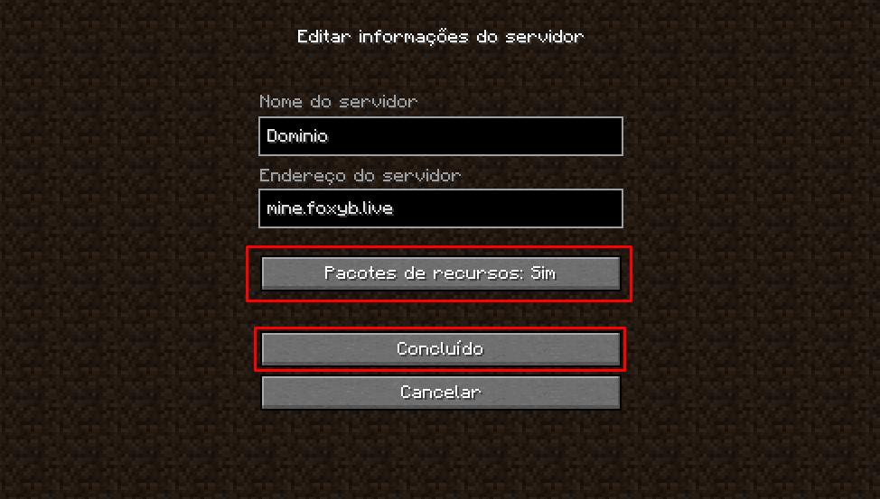

# Erro 162 \(É kickado do servidor quando entra\)

## Eu não consigo entrar no servidor \(erro 162\)

Este erro é simples, você provavelmente negou a resourcepack ao entrar no servidor e logo após foi kickado do servidor!

### Como resolver?

É muuuiiittoo simples, não leva nem 1 minuto, veja abaixo:

1. Clique no servidor e clique em "Edit" ou "Editar"

   2. Abaixo do IP clique em "Pacotes de recursos" até que indique "sim"

   3.Clique em "Concluído", entre no servidor e aceite a resourcepack clicando em "sim".

## Encerramento

Fácil não é?! agora você pode entrar e desfrutar de todas as novas funcionalidades que temos no servidor! 

